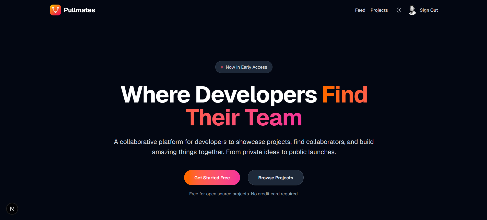

# Pullmates Frontend

Developer Collaboration & Showcase Platform - Frontend



## Overview

The Pullmates frontend is built with Next.js 14+ and provides a modern, responsive interface for developers to showcase projects, find collaborators, and build amazing things together.

## Tech Stack

- **Framework**: Next.js 14+ (App Router)
- **Language**: TypeScript (strict mode)
- **Styling**: Tailwind CSS
- **State Management**: TanStack Query, Zustand
- **Authentication**: NextAuth.js (GitHub OAuth)
- **Icons**: Heroicons

## Getting Started

### Prerequisites

- Node.js 18+ or pnpm

### Installation

```bash
pnpm install
```

### Development Server

```bash
pnpm dev
```

Open [http://localhost:3000](http://localhost:3000) with your browser to see the result.

### Build for Production

```bash
pnpm build
```

### Start Production Server

```bash
pnpm start
```

## Features

- **Responsive Design** - Works on desktop, tablet, and mobile
- **Dark/Light Theme** - Toggle between themes with persistence
- **GitHub Authentication** - Sign in with your GitHub account
- **Project Showcase** - Browse and filter projects by stage
- **Real-time Updates** - Powered by TanStack Query

## Project Structure

```
frontend/
├── app/
│   ├── (auth)/          # Authentication pages
│   ├── (marketing)/     # Public pages (homepage)
│   ├── (app)/           # Protected app pages
│   └── api/             # API routes
├── components/
│   ├── layout/          # Layout components (NavBar)
│   └── ui/              # Reusable UI components
├── lib/
│   ├── auth.ts          # NextAuth configuration
│   ├── types.ts         # TypeScript types
│   └── mock-data.ts     # Development mock data
└── public/              # Static assets
```

## Environment Variables

Create a `.env.local` file:

```env
# Backend API
NEXT_PUBLIC_API_BASE_URL=http://localhost:8080

# NextAuth.js
NEXTAUTH_URL=http://localhost:3000
NEXTAUTH_SECRET=your-secret-here

# GitHub OAuth
GITHUB_CLIENT_ID=your-client-id
GITHUB_CLIENT_SECRET=your-client-secret
```

## Learn More

- [Next.js Documentation](https://nextjs.org/docs)
- [Tailwind CSS](https://tailwindcss.com)
- [NextAuth.js](https://next-auth.js.org)
- [TanStack Query](https://tanstack.com/query)

## License

MIT
